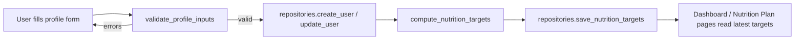
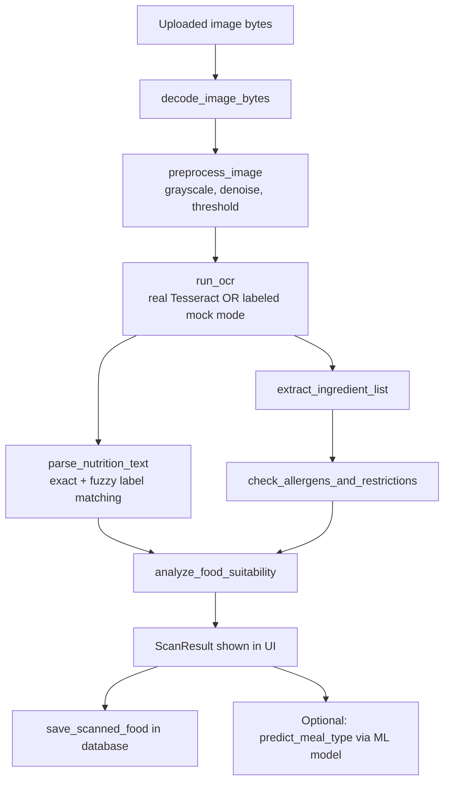
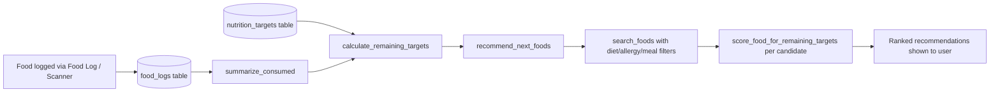
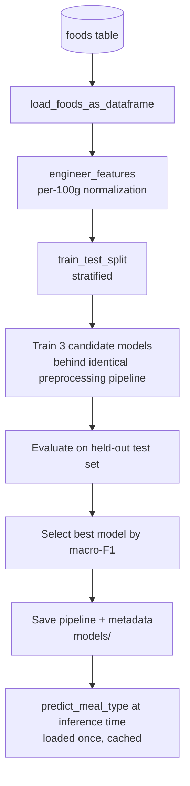

# Data Flow

## 1. Onboarding → Nutrition Targets

```mermaid
flowchart LR
    A[User fills profile form] --> B[validate_profile_inputs]
    B -->|errors| A
    B -->|valid| C[repositories.create_user / update_user]
    C --> D[compute_nutrition_targets]
    D --> E[repositories.save_nutrition_targets]
    E --> F[Dashboard / Nutrition Plan pages read latest targets]
```

## 2. Food Scanner pipeline

```mermaid
flowchart TD
    A[Uploaded image bytes] --> B[decode_image_bytes]
    B --> C[preprocess_image\ngrayscale, denoise, threshold]
    C --> D[run_ocr\nreal Tesseract OR labeled mock mode]
    D --> E[parse_nutrition_text\nexact + fuzzy label matching]
    D --> F[extract_ingredient_list]
    F --> G[check_allergens_and_restrictions]
    E --> H[analyze_food_suitability]
    G --> H
    H --> I[ScanResult shown in UI]
    I --> J[save_scanned_food in database]
    I --> K[Optional: predict_meal_type via ML model]
```

## 3. Daily tracking → "What should I eat next?"

```mermaid
flowchart LR
    A[Food logged via Food Log / Scanner] --> B[(food_logs table)]
    B --> C[summarize_consumed]
    D[(nutrition_targets table)] --> E[calculate_remaining_targets]
    C --> E
    E --> F[recommend_next_foods]
    F --> G[search_foods with diet/allergy/meal filters]
    G --> H[score_food_for_remaining_targets per candidate]
    H --> I[Ranked recommendations shown to user]
```

## 4. ML training → inference

```mermaid
flowchart TD
    A[(foods table)] --> B[load_foods_as_dataframe]
    B --> C[engineer_features\nper-100g normalization]
    C --> D[train_test_split\nstratified]
    D --> E[Train 3 candidate models\nbehind identical preprocessing pipeline]
    E --> F[Evaluate on held-out test set]
    F --> G[Select best model by macro-F1]
    G --> H[Save pipeline + metadata\nmodels/]
    H --> I[predict_meal_type at inference time\nloaded once, cached]
```
